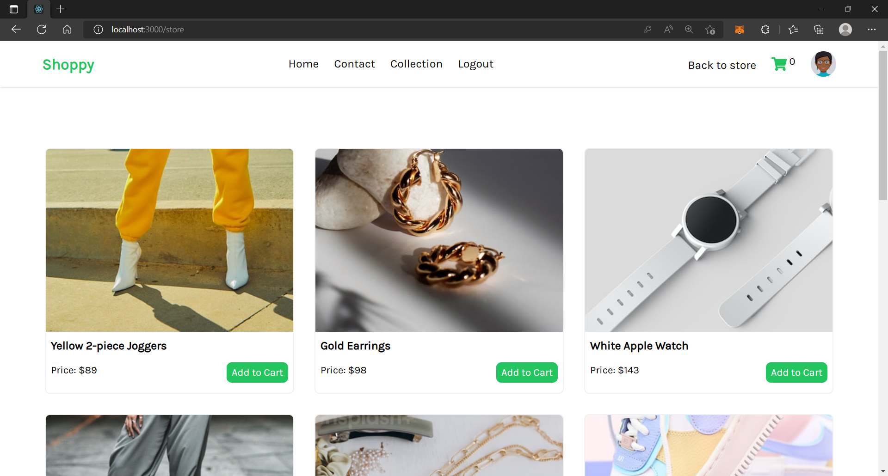

# MY SHOPPING PADDY

## About The Project 

This is a shopping hub platform.

## Frontend Interface of Shoppy Web Application
 

## Technologies Used

- React.js
- Supabase Auth for app's authentication
- Tailwind CSS and CSS for styling
- React Slick to create the sliding carousels
- React-Toastify for notification
- React-icons for the icons
- React-Popup Library for the checkout pop-up
- React-Testing-Library for automated testing of app's functionalities.

## Navigation 🔍

- Home
- Collection
- Contact
- Logout

## Live link

